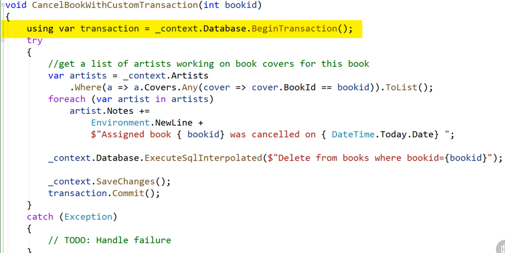
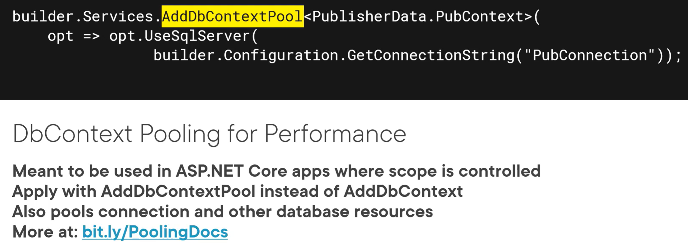

Lazy Loading is off by default.  Below is how you would turn it on.

### Module 11

You can work with Raw SQL, Stored Procs, Views, Table Value Functions, Scalar Functions.

**DBSet Methods to run Raw SQL**

Retrieve entities without relying on LINQ or EF Core's generated SQL.

_context.Authors.FromSqlRaw("some sql string").ToList(); 

_context.Authors.FromSqlInterpolated($"some sql string {var}").ToList();

SQL needs to return data that is in the shape of the DBSet's entity.  Otherwise it will throw an exception.  You can also append an Include off of this.

NEVER use SQL with parameters embedded directly into the string!  That would allow for SQL injection attacks.  Concatenated strings are always unsafe.  Formatted  and interpolated strings are also unsafe if you build it ahead and pass the result to FromSqlRaw.  But, if you put the formatted string directly in the FromSqlRaw method it will parameterize it correctly.  Interpolated passed directly are still unsafe when passed directly.  You have to pass it directly to the FromSqlInterpolated it will work.

You can use TagWith on FromSqlRaw to add comments to the logs when the query executes.

You can do an Add-Migration with no changes and it will create an empty up and down method for you to add any changes you want to make to the database.  This was done in the Migration for createStoredProc.

SQL cannot return shaped data (use Include() to do that)

Keyless entities are always read-only, and they will never be tracked.  This means you can't use Find() to get a record.

### Module 12

If you do an include in a web api and return you can get a SerializerCycleDetected Exception.  This can be fixed by setting the JsonOptions to IgnoreCycles

### Module 14

EF Core mappings are impacted by the nullability of the property.

IsRequired affects the db but not the compiler.

You can use .Ignore to tell EF Core not to map a property.

AutoInclude => You want it to always include a child set when you query.
modelBuilder.Entity\<Author>\().AutoInclude(a => a.Books);

Enums are persisted as integers by default.  You can also use a ValueConversion to convert them to a string.

HasConversion\<string\>();

HasConversion(c => c.ToString(), s=> Color.FromName(s));

DbContext has a ConfigureConventions virtual method with a configurationBuilder for example:

configurationBuilder.Properties\<string\>().HaveColumnType("varchar(100)");

configurationBuilder.Properties\<BookGenre\>().HaveConversion\<string\>();

### Module 15

SaveChanges is always wrapped in a DB Transaction.

Override with an ADO.NET database transaction.

Control workflow of default via Database.Transaction

Override with System.Transactions

#### Concurrency Info

